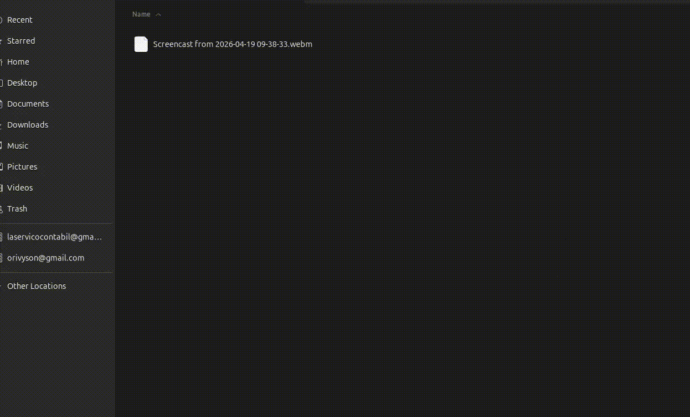
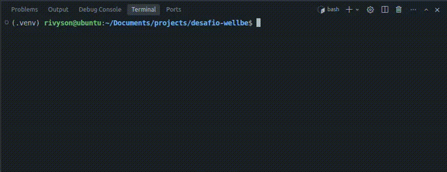

# Desafio Wellbe

Projeto de automação web com **Playwright** e **Django 6**, usando **PostgreSQL** para persistir dados extraídos do site [RPA Challenge](https://rpachallenge.com/).

## O que este repositório faz

1. Abre o desafio no navegador (Chromium).
2. Na seção de busca de filmes, pesquisa, lê os cartões retornados e grava títulos e descrições no modelo Django `Movie`.
3. Na seção de extração de faturas, baixa imagens selecionadas conforme a regra do script e monta um **ZIP em memória**.
4. Salva o arquivo em **`storage/invoices.zip`** (a pasta `storage` é criada automaticamente se não existir).

## Tecnologias

| Área         | Uso principal                          |
|-------------|----------------------------------------|
| Python 3.12 | Linguagem e scripts                    |
| Playwright  | Automação do navegador                 |
| Django 6    | ORM, migrações e configuração do banco |
| PostgreSQL  | Banco de dados                         |

Dependências fixadas em `requirements.txt`.

## Pré-requisitos

- **Python 3.12** (versão alinhada ao ambiente do projeto).
- **PostgreSQL** acessível na rede, com credenciais compatíveis com o `.env`.
- Acesso à internet para o Playwright falar com `https://rpachallenge.com/`.

## Variáveis de ambiente

1. Copie o exemplo e edite os valores:

   ```bash
   cp .env.example .env
   ```

2. No arquivo **`.env`**, configure no mínimo:

   - `DB_POSTGRES_HOST`, `DB_POSTGRES_PORT`, `DB_POSTGRES_USER`, `DB_POSTGRES_PASSWORD`, `DB_POSTGRES_NAME`
   - `SECRET_KEY` e `DEBUG` (exigidos pelo `db/settings.py`)

O arquivo **`.env` não deve ir para o Git** (contém senha e chave). O `.env.example` serve só de modelo.

## Como rodar

```bash
python3.12 -m venv .venv
source .venv/bin/activate
# No Windows: .venv\Scripts\activate

pip install -r requirements.txt
playwright install chromium
```

Suba um PostgreSQL compatível com o que está no `.env`, depois:

```bash
python manage.py migrate
python main.py
```

## Demonstrações

### Chromium (Playwright no RPA Challenge)



### Terminal (execução do `main.py`)



## Organização do código

| Caminho           | Função |
|-------------------|--------|
| `main.py`         | Fluxo Playwright + uso do ORM |
| `manage.py`       | CLI do Django (migrações, shell, etc.) |
| `setup_django.py` | Carrega `.env` e chama `django.setup()` antes do script |
| `db/`             | Projeto Django (`settings`, `urls`) |
| `apps/movies/`    | App com modelo de filmes e migrações |
| `src/utils/`      | Código auxiliar (por exemplo, montagem do ZIP) |

## Apps Django dentro de `apps/`

Cada app fica em `apps/<nome>/`. No `apps/<nome>/apps.py`, a classe `AppConfig` deve declarar **`name = 'apps.<nome>'`**. Em `db/settings.py`, em `INSTALLED_APPS`, use a string **`'apps.<nome>'`** (por exemplo `'apps.movies'`).

## Dump SQL (entrega do desafio)

O Django já cria e atualiza o esquema no PostgreSQL quando você aplica as migrações:

```bash
python manage.py migrate
```

Isso usa os arquivos em `*/migrations/` (código Python gerenciado pelo Django), não um `.sql` solto.

Em todo caso, para cumprimento do requisito do desafio um **dump SQL** exportado, ele encontra-se na **raiz do projeto**: [`dump-desafio_wellbe.sql`](dump-desafio_wellbe.sql) (gerado com `pg_dump` sobre o banco já migrado; você pode voltar a exportar depois de rodar o `main.py` se quiser dados mais recentes).
